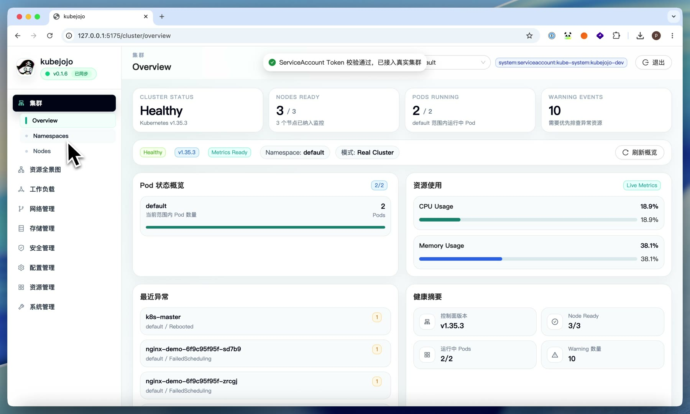
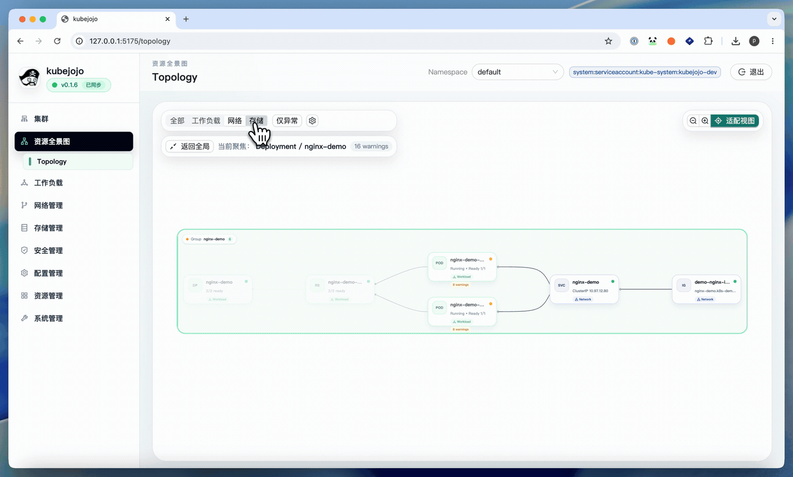
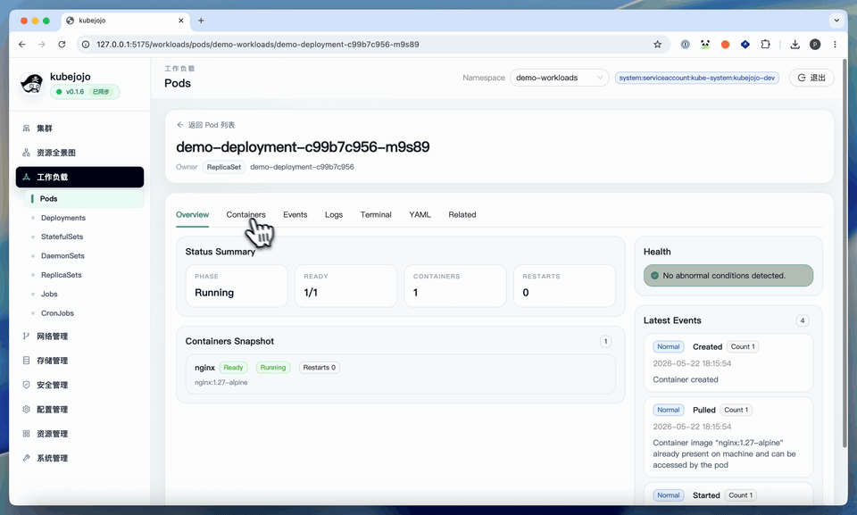
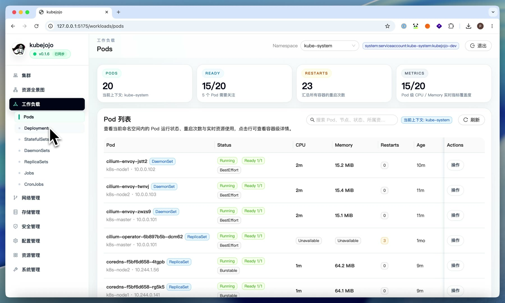
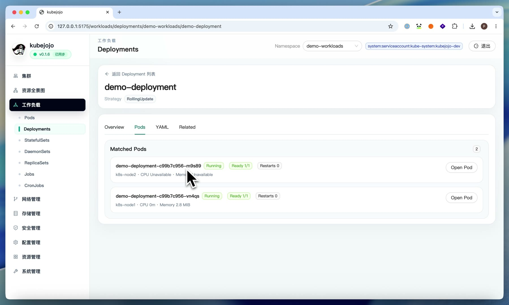
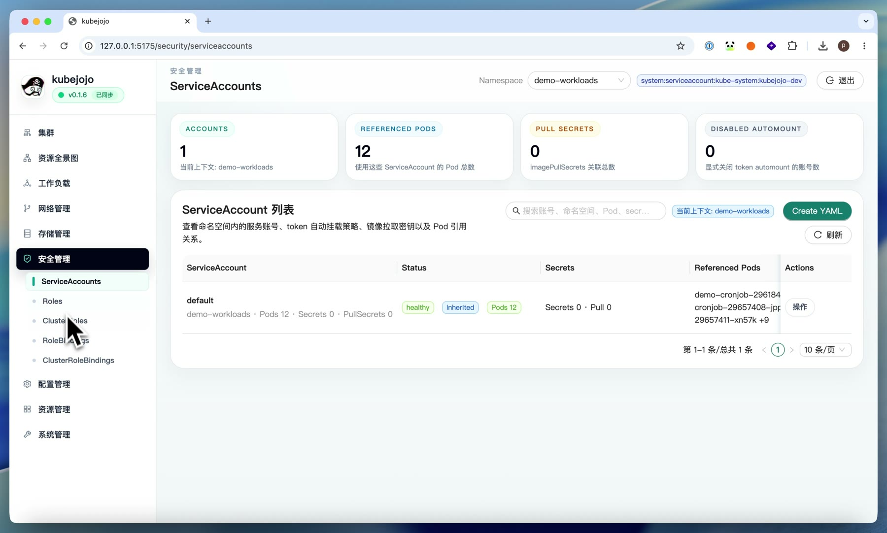
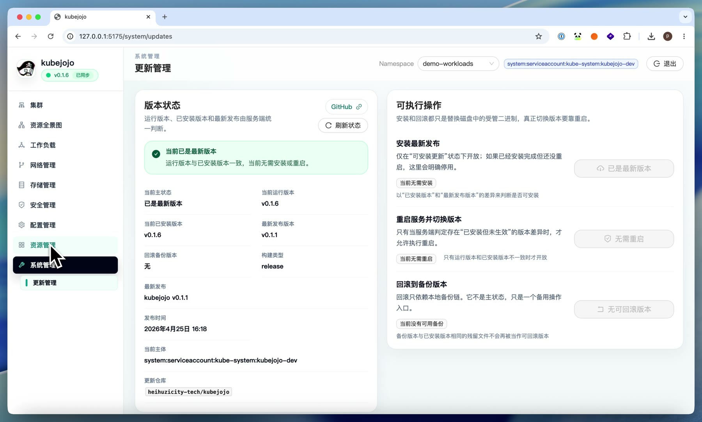

<div align="center">

# Captain Kube · 船长 K8s

A single-cluster Kubernetes console for the people who run it: see the whole cluster, chase down problems and change config from one place.

[简体中文](README.md) · English

</div>



## What it is

Running a Kubernetes cluster usually means hopping between kubectl, dashboards and log tools: spot what's red, find the Pod, read the events, check the logs, exec in, and finally edit some YAML. Captain Kube puts that whole path in one place.

- The home page is the whole cluster, with resource relationships drawn as a topology and problems marked right on it.
- Open a Pod and its status, events, logs, YAML, related resources and a terminal are all on one page.
- Most resources can be viewed, edited, created and deleted as YAML, and the usual scale, restart and suspend actions are one click.
- You sign in with the cluster's own ServiceAccount token, so permissions follow RBAC instead of a second user system.
- Release builds embed the frontend in the backend, so it's a single binary, and you can check for, install and roll back new versions from the UI.

It manages one cluster and doesn't try to be a multi-cluster tool.

> Formerly kubejojo. The binary and environment variables still use `kubejojo` for now and will be renamed in a later release.

## A quick look

<table>
<tr>
<td width="50%"><br><sub>Topology: workloads, networking and storage in one relationship view, problems marked in red</sub></td>
<td width="50%"><br><sub>Pod troubleshooting: logs, events and a terminal along one path</sub></td>
</tr>
<tr>
<td><br><sub>Pods: namespace, health and resource usage at a glance</sub></td>
<td><br><sub>Deployment details: matching Pods, events and common actions</sub></td>
</tr>
<tr>
<td><br><sub>Access: view and edit by ServiceAccount, Role and Binding</sub></td>
<td><br><sub>Updates: check for new versions, install, roll back, restart</sub></td>
</tr>
</table>

## Getting it running

In development the backend and frontend run separately. You need Go for the backend and Node.js for the frontend.

```bash
# backend, http://127.0.0.1:8080 by default
cd server
export KUBEJOJO_KUBECONFIG=/path/to/your/kubeconfig
go run ./cmd/kubejojo

# frontend, http://127.0.0.1:5174 by default, proxies /api to the backend
cd web
npm install
npm run dev
```

The backend looks for cluster config in `KUBEJOJO_KUBECONFIG`, then `KUBECONFIG`, then `~/.kube/config`. Signing in to a real cluster takes a ServiceAccount token; demo mode is there if you only want to look around.

For a lab cluster you can get an admin token like this (in production, bind the least privilege you need rather than `cluster-admin`):

```bash
kubectl create serviceaccount kubejojo-dev -n kube-system
kubectl create clusterrolebinding kubejojo-dev \
  --clusterrole=cluster-admin \
  --serviceaccount=kube-system:kubejojo-dev
kubectl create token kubejojo-dev -n kube-system
```

For real deployments, grab a package for your platform (Linux amd64/arm64, macOS arm64) from [Releases](https://github.com/heihuzi-labs/captain-kube/releases). It contains one binary with the frontend embedded and a systemd unit. Or build it yourself:

```bash
./scripts/build-release.sh                              # current platform
GOOS=linux GOARCH=arm64 ./scripts/build-release.sh      # a specific platform
```

The output goes to `server/dist/release/`.

## Online updates

With online updates on, the system page can check for new versions, install them, roll back and restart the service.

| Variable | What it does |
| --- | --- |
| `KUBEJOJO_UPDATE_ENABLED` | Turns the online update page on |
| `KUBEJOJO_UPDATE_REPOSITORY` | Which repo's Releases to pull from; defaults to `heihuzicity-tech/kubejojo`, which now redirects here |
| `KUBEJOJO_UPDATE_ALLOWED_SUBJECTS` | Kubernetes identities allowed to update, roll back and restart, comma separated |
| `KUBEJOJO_UPDATE_ALLOW_PRERELEASES` | Whether to consider rc and beta releases |
| `KUBEJOJO_UPDATE_GITHUB_TOKEN` | Optional; steadier GitHub API access and higher rate limits |
| `KUBEJOJO_UPDATE_TARGET_PATH` | Optional; the path of the managed binary |

## Development

```text
server/   Go backend: client-go, update service, embedded frontend
web/      React frontend: Ant Design, TanStack Query
scripts/  release packaging
docs/     product scope, operation guide, README screenshots
```

Pushing a `v*` tag runs the release: frontend build, backend `go test ./...`, packages for three platforms plus `checksums.txt`, and a GitHub Release.

The full scope is in the [product baseline](docs/产品方案与需求基线.md) and the lab cluster steps are in the [operation guide](docs/operation-guide.md) (both in Chinese).

## License

[MIT](LICENSE). Kubernetes is a trademark of The Linux Foundation; this project is not affiliated with it.

---

<sub>Part of the Captain series from [heihuzi-labs](https://github.com/heihuzi-labs): [Captain Agents](https://github.com/heihuzi-labs/captain-agents) · **Captain Kube** · [Captain Ops](https://github.com/heihuzi-labs/captain-ops) · [Captain Password](https://github.com/heihuzi-labs/captain-password) · [Captain Todo](https://github.com/heihuzi-labs/captain-todo)</sub>
